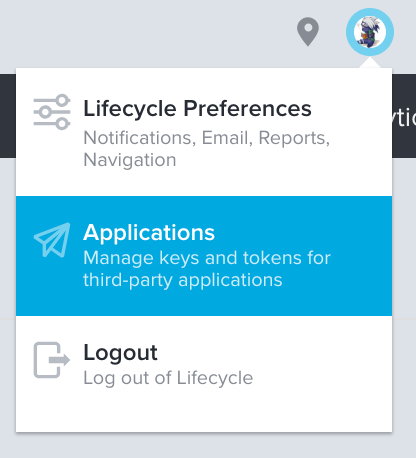

Every request to the VersionOne API must have the Authroization HTTP Header set using either your username and password or an access token. Access tokens are associated with an application and grant the application certain access to resources. The application can act on behalf of the member who created the access token.

## Access Tokens

VersionOne uses access tokens to grant access to the API. You can register a new access token by
logging into VersionOne and navigating to the Applications page. This is the suggested way to interact with the VersionOne API.

```bash
curl "https://V1Host/V1Instance/api_endpoint_here"
  -H "Authorization: Bearer <access-token>"
```




## Username and Password

You may use your username and password using Basic authentication by setting the Authroization header.
You'll have to base64 encode `username:password` including the `:`!

```bash
curl "https://V1Host/V1Instance/api_endpoint_here"
  -H "Authorization: Basic username:password"
```

<aside class="notice">
  <div class="content">
    You can set your access token by clicking the avatar in the bottom left!
  </div>
</aside>